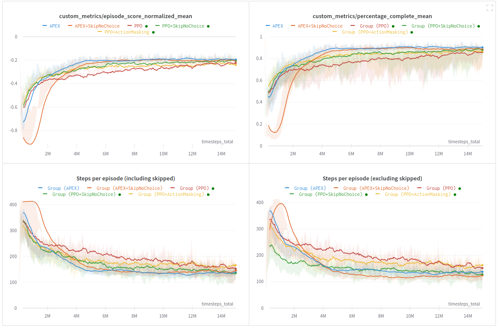

# Frame skipping and action masking

```{admonition} TL;DR
We tested how skipping states, where agents do not need to choose an action, and masking invalid actions impact the performance of RL agents. 
```

### 💡 The idea

In these experiments we looked at two modifications with to goal of easing the learning for RL agents:

- **Skipping "no-choice" cells**: Between intersections, agents can only move forward or stop. Since trains stop automatically when blocked by another train until the path is free, manual stopping only makes sense right before intersection, where agents might need to let other trains pass first in order to prevent deadlocks. To capitalize on this, we skip all cells, where the agent is not on or next to an intersection cell. This should help agents in the sense that they no longer need to learn to keep going forward between intersections. Also skipping steps shortens the preserved episode length.

- **Action masking**: The Flatland action space consists of 5 discrete actions (noop, forward, stop, left, right). However, at any given timestep, only a subset of all actions is available. For example, left and right are mutually exclusive and are both invalid on straights. Furthermore, the noop-action is not required and can be removed completely. We test masking out all invalid and noop actions so that the agents can focus on relevant actions only.

We implemented and evaluated skipping "no-choice" cells for both DQN APEX [1] and PPO agents [2]. Currently, action masking is only implemented for PPO agents. All experiments are performed on `small_v0` environments with the stock tree observations.

### 🗂️ Files and usage

All configuration files to run these experiments can be found in `baselines/action_masking_and_skipping`:

```shell script
# APEX:
python ./train.py -f baselines/action_masking_and_skipping/apex_tree_obs_small_v0.yaml

# APEX + SkipNoChoice
python ./train.py -f baselines/action_masking_and_skipping/apex_tree_obs_small_v0_skip.yaml

# PPO
python ./train.py -f baselines/action_masking_and_skipping/ppo_tree_obs_small_v0.yaml

# PPO + SkipNoChoice
python ./train.py -f baselines/action_masking_and_skipping/ppo_tree_obs_small_v0_skip.yaml

# PPO + ActionMasking
python ./train.py -f baselines/action_masking_and_skipping/ppo_tree_obs_small_v0_mask.yaml
```

#### Skipping "no-choice" cells

Skipping "no-choice" cells is implemented in the gym_env wrapper [SkipNoChoiceCellsWrapper](https://gitlab.aicrowd.com/flatland/neurips2020-flatland-baselines/blob/master/envs/flatland/utils/gym_env_wrappers.py#L90) and can be controlled with the following environment configurations:

- `skip_no_choice_cells` (bool): Setting this to `True` will activate the skipping of "no-choice" cells.
- `accumulate_skipped_rewards` (bool): Setting this to `True` will accumulate all skipped reward.
- `discounting` (float): Discount factor when summing the rewards. This should be set to the same value as the environment's discount factor &gamma;.

#### Action masking

Action masking requires a `available_actions` observation that encodes which actions are available. This is implemented in the gym_env wrapper [AvailableActionsWrapper](https://gitlab.aicrowd.com/flatland/neurips2020-flatland-baselines/blob/master/envs/flatland/utils/gym_env_wrappers.py#L35) and can be controlled with the following environment configurations:

- `available_actions_obs` (bool): Setting this to `True` will activate the `available_actions` observation.
- `allow_noop` (bool): If set to `False`, the `ǹoop` action will always be invalid, effectively removing it from the action space.

Action masking is implemented for `fully_connected_model`, `global_dens_obs_model` and `global_obs_model` and can be controlled with the following custom model configurations:

- `mask_unavailable_actions` (bool): Setting this to `True` will activate the action masking.


### 📦 Implementation Details

- Available actions are encoded into 0/1 vectors with number of actions elements. 1 indicates that action with corresponding index is available.
- Invalid actions are masked by setting their logits to large negative values, effectively setting their softmax-probabilities to zero.
- For PPO experiments we do **not** share weights between policy and value function.

### 📈 Results



W&B report: [https://app.wandb.ai/masterscrat/flatland/reports/Skipping-%22no-choice%22-cells-and-action-masking-expriments--VmlldzoxNTY5NDM](https://app.wandb.ai/masterscrat/flatland/reports/Skipping-%22no-choice%22-cells-and-action-masking-expriments--VmlldzoxNTY5NDM)

- Vanilla APEX agents learn fastest w.r.t number of samples.
- APEX+SkipNoChoice agents require more frames to learn compared to vanilla APEX but converge to similarly strong policies.
- For PPO, both SkipNoChoice and ActionMasking improved the learning.
- APEX, APEX+SkipNoChoice and PPO+SkipNoChoice converge to similarly strong policies after 15M frames. PPO and PPO+ActionMasking end up with slightly worse performance. It is not clear whether agents would profit from more frames. Policy gradients like PPO are known to usually be less sample efficient than DQN based algorithms like APEX.
- For PPO agents, skipping leads to more diverse batches while APEX agents already have a large replay buffer to ensure diverse update samples. Therefore, the semantics of the skipping "no-choice" cells modification is a bit different for these algorithms. 

### 🔗 References

[1] Schulman, J. et al. (2017). Proximal policy optimization algorithms.  [arXiv:1707.06347](https://arxiv.org/abs/1707.06347).

[2] Horgan, D., et al. (2018). Distributed prioritized experience replay. [arXiv:1803.00933](https://arxiv.org/abs/1803.00933).


### 🌟 Credits

[Christian Scheller](https://scholar.google.com/citations?user=LD2JqfMAAAAJ)

[Florian Laurent](https://twitter.com/MasterScrat)

[Adrian Egli](https://twitter.com/ae_sbb)
