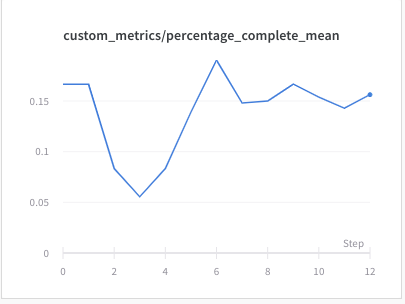

# Local conflict prediction observation fc-net experiments

## Observation

We created a set of custom observations as explained in detail below in the sections. The observations work by capturing the agent data from the most conflicting `n_local = 5` agents and the conflict prediction related information.

### Agent Specific Observations
First we look at the simple agent observations <br>
There are some general observations we provide to the agent
```python

malfunction=agent.malfunction_data['malfunction'] / max_distance,
malfunction_rate=agent.malfunction_data['malfunction_rate'],
next_malfunction=agent.malfunction_data['next_malfunction'] / max_distance,
nr_malfunctions=agent.malfunction_data['nr_malfunctions'],
speed=agent.speed_data['speed'],
position_fraction=agent.speed_data['position_fraction'],
transition_action_on_cellexit=agent.speed_data['transition_action_on_cellexit'],
num_transitions=num_transitions,
moving=agent.moving,
status=agent.status
```

### Shortest and Alternate Observation Vector
We use the shortest path observation
observation_shortest and observation_next_shortest represent a 3-size vector for the actions L,F and R.
If no alternate path exists both of the values would be same
E.g. observation_shortest = [0, 1, 0] refers to Forward (F) shortest path
observation_next_shortest = [0, 0, 1] refers to taking action Right (R) for an alternate route

### Conflict Prediction Matrix
When we analyse agents, we can resolve agent conflicts based on the following criteria
-  Distance to Target and Extra Distance to be travelled in case of any alternate path
-  Steps after which first conflict happens
-  Number of agents with which an agent has conflicts with

### Target and Extra Distance
This is the vector for the distance from target to the shortest path and the alterante path if it exists
Extra Distance is the extra distance to target in case of an alternate route. All these variables are normalised by max_distance which is calculated as the total of width and height.

### Agent Conflict Count Matrix
We calculate the conflicts with the agents upto a future number of steps or `max_depth` which is currently set at 30. We only show the first 10 steps for brevity. <br>
We show an example with 7 agents to show the conflict count matrix <br>
| Steps/AgentNo | 0   | 1   | 2   | 3   | 4   | 5   | 6   |
| ------------- | --- | --- | --- | --- | --- | --- | --- |
| 0             | 0   | 0   | 0   | 0   | 0   | 0   | 0   |
| 1             | 0   | 0   | 0   | 0   | 0   | 0   | 0   |
| 2             | 0   | 0   | 0   | 0   | 0   | 0   | 0   |
| 3             | 0   | 0   | 0   | 0   | 0   | 0   | 0   |
| 4             | 0   | 0   | 0   | 0   | 0   | 0   | 0   |
| 5             | 0   | 0   | 0   | 0   | 0   | 0   | 0   |
| 6             | 1   | 1   | 0   | 0   | 0   | 0   | 0   |
| 7             | 1   | 1   | 0   | 0   | 0   | 0   | 0   |
| 8             | 0   | 1   | 0   | 1   | 0   | 0   | 0   |
| 9             | 0   | 0   | 0   | 0   | 0   | 0   | 0   |


<br> We see that agent 0 and 1 are conflicting after step 7 and 8 (We increase the steps by 1 as python indexing starts from 0). Similarly agents 1 and 3 are conflicting after step 9. Note that there maybe more than one pair of agents conflicting in which case the value in each cell can range from 0-6<br>
<br> We further normalise the agent count by dividing with the number of agents <br>

| Steps/AgentNo | 0      | 1      | 2   | 3      | 4   | 5   | 6   |
| ------------- | ------ | ------ | --- | ------ | --- | --- | --- |
| 0             | 0      | 0      | 0   | 0      | 0   | 0   | 0   |
| 1             | 0      | 0      | 0   | 0      | 0   | 0   | 0   |
| 2             | 0      | 0      | 0   | 0      | 0   | 0   | 0   |
| 3             | 0      | 0      | 0   | 0      | 0   | 0   | 0   |
| 4             | 0      | 0      | 0   | 0      | 0   | 0   | 0   |
| 5             | 0      | 0      | 0   | 0      | 0   | 0   | 0   |
| 6             | 0.1428 | 0.1428 | 0   | 0      | 0   | 0   | 0   |
| 7             | 0.1428 | 0.1428 | 0   | 0      | 0   | 0   | 0   |
| 8             | 0      | 0.1428 | 0   | 0.1428 | 0   | 0   | 0   |
| 9             | 0      | 0      | 0   | 0      | 0   | 0   | 0   |
This is represented by the variable `agent_conflicts_count_path` in the implementation

### Agent Conflict Step Matrix
Taking the above example, we can calculate the steps after which conflicts occurs
<br>
We calculate at each future step what is the minimum of steps after which conflict occurs between a pair of agents. 
We show a sample step conflict matrix at step 30. 
<br>
| AgentNo | 0   | 1   | 2   | 3   | 4   | 5   | 6   |
| ------- | --- | --- | --- | --- | --- | --- | --- |
| 0       | 1   | 7   | 1   | 1   | 1   | 1   | 1   |
| 1       | 7   | 1   | 1   | 9   | 1   | 1   | 1   |
| 2       | 1   | 1   | 1   | 1   | 1   | 1   | 1   |
| 3       | 1   | 9   | 1   | 1   | 1   | 1   | 1   |
| 4       | 1   | 1   | 1   | 1   | 1   | 1   | 1   |
| 5       | 1   | 1   | 1   | 1   | 1   | 1   | 1   |
| 6       | 1   | 1   | 1   | 1   | 1   | 1   | 1   |

There would be a similar matrix for every step. Note here that we only record the step at which the first conflict occurs. Since agents 0 and 1 conflict at steps 7 and 8, we only take the first conflict i.e 7.
The matrix values should be symmetric.
<br> we normalise by dividing by the total number of `max_depth` <br>

| AgentNo | 0     | 1     | 2   | 3   | 4   | 5   | 6   |
| ------- | ----- | ----- | --- | --- | --- | --- | --- |
| 0       | 1     | 0.233 | 1   | 1   | 1   | 1   | 1   |
| 1       | 0.233 | 1     | 1   | 0.3 | 1   | 1   | 1   |
| 2       | 1     | 1     | 1   | 1   | 1   | 1   | 1   |
| 3       | 1     | 0.3   | 1   | 1   | 1   | 1   | 1   |
| 4       | 1     | 1     | 1   | 1   | 1   | 1   | 1   |
| 5       | 1     | 1     | 1   | 1   | 1   | 1   | 1   |
| 6       | 1     | 1     | 1   | 1   | 1   | 1   | 1   |

This is represented by the variable `agent_conflicts_step_path` in the implementation
### Determining the most conflicting pair of agents
We use a parameter `n_local` currently defaulted to 5 to find the most conflicting pair of 5 agents. Given a agent, we need to identify these 4 other agents which is done by looking at the Agent Conflict Step Matrix

<br> First we identify a cut off number of steps to check the conflicts.
We use the below logic which is normalised based on the grid and agent sizes, subject to a ceiling based on `max_depth`
```python

avg_dim = (x_dim * y_dim) ** 0.5
depth = int(n_local * avg_dim / n_agents)

agent_conflict_steps = min(max_depth - 1, depth)
```
At this `agent_conflict_steps`, we look at the agent step conflict matrix to determine the 4 other agents.
In the example shown below, for agent 1, the most conflicting 4 other agents would be 0 and 3 by choosing the least values in the matrix (0 represents immediate conflict and 1 represents no conflict) The other 2 agents are taken randomly as of now as there are only 2 conflicts after `agent_conflict_steps`
| AgentNo | 0     | 1   | 2   | 3   | 4   | 5   | 6   |
| ------- | ----- | --- | --- | --- | --- | --- | --- |
| 1       | 0.233 | 1   | 1   | 0.3 | 1   | 1   | 1   |

### Conflicting agent observations
After choosing the conflict agents, we also obtain the [general observations](#agent-specific-observations) for each of these identified *local* agents.  
Similarly We also get the local agent observations for the [shortest and alternate path](#shortest-and-alternate-observation-vector), [Target and Extra Distance](#target-and-extra-distance)

### Local agents step matrix
We use the first **3** steps for the  selected `n_local` agents in the `agent_conflicts_step_path`
This can be got by extracting the matrix and obtaining the values for the respective pairs of agents  
For getting the first step or Step #0, we do
```python
agent_conflicts_step_path[0][i, ls_other_local_agents]
```
where `i` is the currently selected agent and `ls_other_local_agents` are its 4 most conflicting agents  
We get a set of `n_local-1` for each step leading to a total of `3*(n_local-1)`

### Local agents count matrix
We use the first **3** steps for the  selected `n_local` agents in the `agent_conflicts_step_path`
This can be got by extracting the matrix and obtaining the values for the respective pairs of agents  
For getting the first step or Step #0, we do
```python

agent_conflicts_count_path[0][ls_local_agents]
```
where `ls_local_agents` are the current agent  and its 4 most conflicting agents 
We get a set of `n_local` for each step leading to a total of `3*n_local`

### Agent Conflict Average Step
`agent_conflicts_avg_step_count` is calculated by adding the step conflicts after `max_depth` steps.
The values are added for each agent, represented in the column **Total** below. 
| AgentNo | 0     | 1     | 2   | 3   | 4   | 5   | 6   | Total |
| ------- | ----- | ----- | --- | --- | --- | --- | --- | ----- |
| 0       | 1     | 0.233 | 1   | 1   | 1   | 1   | 1   | 6.233 |
| 1       | 0.233 | 1     | 1   | 0.3 | 1   | 1   | 1   | 5.533 |
| 2       | 1     | 1     | 1   | 1   | 1   | 1   | 1   | 7     |
| 3       | 1     | 0.3   | 1   | 1   | 1   | 1   | 1   | 6.3   |
| 4       | 1     | 1     | 1   | 1   | 1   | 1   | 1   | 7     |
| 5       | 1     | 1     | 1   | 1   | 1   | 1   | 1   | 7     |
| 6       | 1     | 1     | 1   | 1   | 1   | 1   | 1   | 7     |

Finally we calculate the average of the **Total** column and average by dividing by number of agents to normalise. <br>
This final value of 0.94 is then used as part of the observations. This gives an indication of the density of conflicts. A value close to 1 indicates less conflicts upto `max_depth` steps.

### Total Observations Dimensions
The total dimensions for the observation can be calculated using the formula
```python

1 + 3 * (n_local - 1) + 22 * n_local
```
This can be found by adding the following observations  
* [1 - Agent Conflict Average Step](#Agent-Conflict-Average-Step) 
* [3 - Local Agent Conflict Steps](#local-agents-step-matrix)
* [22 - Other observations for local agents](#conflicting-agent-observations)

### Method
This flattened observation vector of dimension `1 + 3 * (n_local - 1) + 22 * n_local` is the final observation which becomes the basis for modelling in a fully-connected neural network

TODO

## Results

|                          | Mean score | Mean norm. score | Mean % completed |
| ------------------------ | :--------: | :--------------: | :--------------: |
| FullyConnected [256,256] |            |                  |                  |

(*preliminary*)

## Plots



(*preliminary*)

## Conclusion

TODO

## References

TODO
