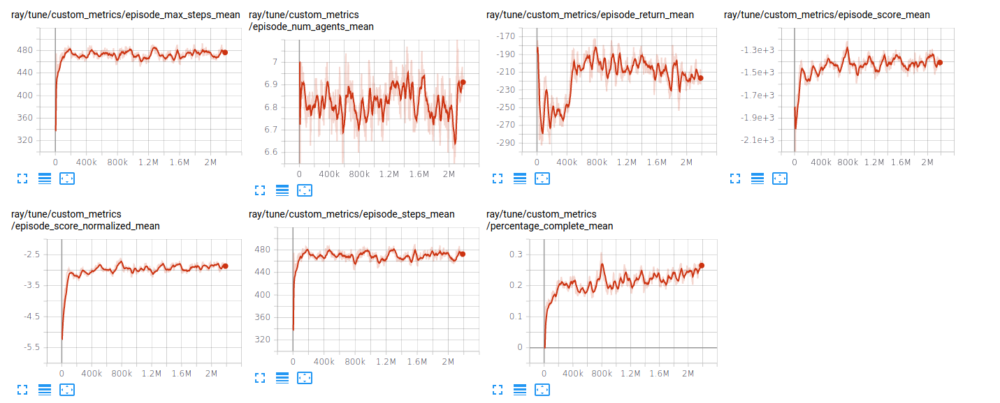

# Local treeobservations observation fc-net experiments

## Method

TODO

## Results

|            | Mean score | Mean norm. score | Mean % completed|
| ---------- |:----------:|:----------------:|:---------------:|
| FullyConnected [256,256] |   |             |               |

(*preliminary*)

## Plots

(*preliminary*)

## Conclusion

TODO

## Refrences

TODO
