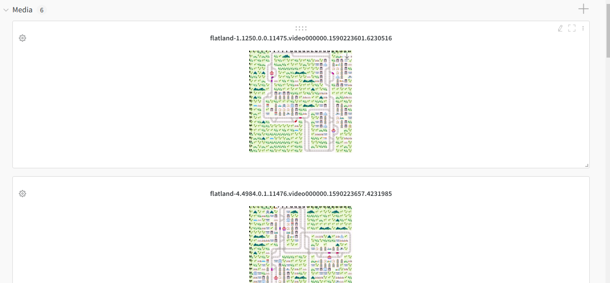

# Saving Recorded Video

We use `gym monitor` for video recording

To use human rendering with recording and uploading videos, update the env_config as follows
```
env_config:
    render: human
```
This saves videos to the folder `flatland` in the same location as the running script.

To add a custom location, set the config `video_dir` under env_config

```
        env_config:
            render: human
            # For saving videos in custom folder and to wandb.
            # By default if not specified folder is flatland 
            video_dir: small_tree_video 
```

By default, the folder is cleared before saving the new videos. This is done as all videos with the pattern `*0.mp4` are used for uploading to wandb and we do not want to upload videos from older runs

This behavior can be changed using the config parameter `resume: True`

When we process videos, we sort videos which are more recent (based on the latest modified time). Hence videos would appear in descending order in wandb under the section media.

## Sample video uploaded to wandb


## Sample script to save videos
We have provided a simple config which runs 6 iterations and saves the videos to wandb. Change the wandb configs if required before running.

```bash
python train.py -f recording/ppo.yaml
```

Note that videos may not be created for the last iteration for each worker, as the videos for the last iterations are saved only once the process is stopped. RLlib seems to not execute the `on_result` step once the stop condition is achieved. Instead the process is closed finally once the program finishes and only then the video recorder is flushed. Hence, the last video cannot be uploaded directly to wandb during `on_result`.

## Video Folder Names
flatland-1.1250.0.0.11475.video000000.1590223601.6230516

Currently video naming convention is 
`flatland-{iteration}-{steps}.{percentage_completition_mean}.{episode_id}.{pid}.video000000.{last_modified_time}`

The first part comprising of `iteration,steps,percentage_completition_mean` are the env stats from when the first result occurs just immediately after the video was first created. Look at the section [TODO](#TODO) for more details regarding this choice.

The second part `{episode_id}.{pid}.video000000` is basically as per the convention used for video names in the openai.gym monitor. episode_id is the current worker's episode number, pid is the process ID for the process which saved the video recording. Often, the last frames are recorded as `*video000001.mp4` which we ignore and don't upload to wandb to reduce the number of videos uploaded to wandb.

We check videos for changes in the last modified time as often there can be multiple versions of same video in different stages of recording. We reupload the videos if the last modified time has changed.

Once the run is finished, the uploaded video are also copied to the `logdir` or the `ray` folder for the current run

# Evaluation
We can enable rendering during evaluation instead of the normal training process to periodically save videos without slowing down the training process too much. This will take the new config settings and videos will be saved. All videos will be saved in the `video_dir` or the default `flatland` folder. In the same wandb process we only resume videos and we don't overwrite any content in the same folder. Hence we can opt to manually delete the existing videos (If videos from older runs exist in the same folder) or specify a new `video_dir` to save videos in a different folder in such cases.

# CAUTION
If we are running multiple wandb process, caution should be taken to avoid writing to the same folder. The recommended practice is to create a different `video_dir` for each run to avoid any conflicts and accidently deleting other run files.

# TODO
- Cannot match exact env details on which video was created and hence defaulting to the env details from when the video was first created. To help identify we must record the video file with the env iteration or/and steps etc. 
- Using the env details when the video was created may be useful when recording video during evaluation. In such cases, we are more interested in the latest training state than the current evaluation run details.
- The last episode videos are not saved due to the reasons mentioned in the [section](#sample-script-to-save-videos)

